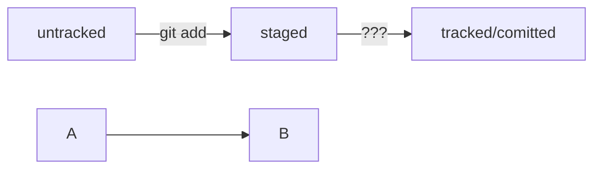

# Основы Git

Этот репозиторий содержит базовую информацию о системе контроля версий Git. В данном руководстве вы найдете основные команды и концепции, которые помогут вам начать работу с Git.

## Содержание
- [Что такое Git?](#что-такое-git)
- [Основные команды Git](#основные-команды-git)
  - [Инициализация репозитория](#инициализация-репозитория)
  - [Создание коммитов](#создание-коммитов)
  - [Просмотр истории](#просмотр-истории)
  - [Работа с ветками](#работа-с-ветками)
- [Диаграмма рабочего процесса](#диаграмма-рабочего-процесса)
- [Полезные ссылки](#полезные-ссылки)

## Что такое Git?

**Git** — это распределённая система контроля версий, которая позволяет разработчикам отслеживать изменения в коде, работать над проектом совместно, сохраняя историю изменений и обеспечивая возможность вернуться к любому состоянию проекта в любой момент времени.

## Основные команды Git

### Инициализация репозитория

Чтобы начать использовать Git в вашем проекте, необходимо инициализировать репозиторий:

```bash
git init
```


